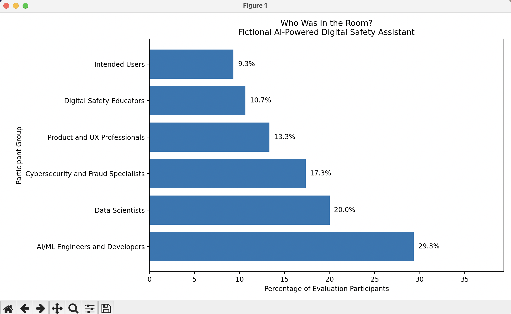

# Who Wasn't in the Room?

**A Human-Centered AI Evaluation Framework and Python Prototype**

Who Wasn't in the Room? is an exploratory human-centered AI evaluation framework designed to make participation in AI evaluation more visible.

AI evaluations can tell us a great deal about model performance, security, red-team findings, benchmarks, and observed system behavior. Those results matter. But they do not always tell us who helped determine what needed to be tested in the first place.

> **A system card can tell me what you tested. I also want to know who helped you understand what needed testing in the first place.**

This project explores a simple idea: technical expertise helps us understand what an AI system can do, while human context can help us understand what may happen when people actually use it.

---

## Why I Built This

While studying AI evaluation practices and working on AI evaluation, safety, cybersecurity, and responsible AI projects, I kept coming back to a question:

**Who was in the room when the evaluation was designed?**

AI developers, machine learning engineers, data scientists, cybersecurity professionals, researchers, red teams, and other technical experts play critical roles in AI evaluation. This framework is not an argument for replacing or reducing technical expertise.

Instead, it asks whether the evaluation also included the people, perspectives, domain knowledge, and lived contexts necessary to recognize risks that may not be obvious from the development environment.

A technically rigorous evaluation can still have blind spots if an important scenario was never imagined.

Sometimes the risk we miss is not the test that failed. It is the test nobody in the room thought to run.

---

## The Five Questions

The framework currently centers on five questions.

### 1. Who is this for?

Who are the intended users?

Who may also interact with the system even if they were not the primary audience?

Who could be affected by the system's decisions, recommendations, outputs, or failures?

### 2. Who decided what needed testing?

Who determined which risks, behaviors, failure modes, and outcomes deserved evaluation?

Did that process include only the development team, or were other forms of expertise involved?

### 3. Who actually tested it?

Who participated in technical testing, red teaming, usability testing, field testing, or other forms of evaluation?

Participation alone does not establish that an evaluation was sufficient, but understanding who participated provides important context.

### 4. Who wasn't in the room?

Which relevant populations, perspectives, environments, abilities, ages, areas of expertise, or experiences may not have been represented?

This question should not automatically be interpreted as evidence that an evaluation was inadequate. It is a prompt for further investigation.

### 5. What changed because people were in the room?

Did participant feedback lead to changes in the system?

Did it create new tests, identify new risks, change safeguards, alter deployment decisions, improve documentation, or affect monitoring?

This distinction matters because participation itself is not necessarily evidence of influence.

**Were people meaningfully involved, or merely present?**

---

## The Prototype

The current Python prototype asks the evaluator to enter participant groups and the number of people from each group.

It then calculates participant representation and generates a visualization showing **Who Was in the Room?**

The visualization is intentionally descriptive rather than judgmental.

It does not assign a score.

It does not determine whether an AI system is safe.

It does not determine whether a participant group is sufficiently represented.

It makes participation visible so that humans can ask better evaluation questions.

---

## Example Visualization



*Illustrative example using fictional participant data. This visualization demonstrates how the framework makes participation visible and does not represent an actual AI system or evaluation.*

The example represents a fictional evaluation of an **AI-Powered Digital Safety Assistant**.

The fictional evaluation includes:

| Participant Group | Participants | Representation |
|---|---:|---:|
| AI/ML Engineers and Developers | 22 | 29.3% |
| Data Scientists | 15 | 20.0% |
| Cybersecurity and Fraud Specialists | 13 | 17.3% |
| Product and UX Professionals | 10 | 13.3% |
| Digital Safety Educators | 8 | 10.7% |
| Intended Users | 7 | 9.3% |
| **Total** | **75** | **100%** |

The interesting question is not whether 9.3% intended-user participation is automatically "good" or "bad."

The framework instead asks deeper questions. Who were those intended users? Were relevant user populations represented? Were they brought in only after the system was built, or did their experiences help determine what the team needed to test?

That distinction is part of what this project is designed to surface.

---

## What the Chart Cannot Tell Us

A visualization of participant representation is useful, but it is not the evaluation itself.

Two evaluations could have identical participant distributions and still be very different in quality.

One group of users might have meaningful influence over testing priorities and design decisions. Another might simply be asked to interact with a nearly finished product.

That is why **Who Wasn't in the Room?** does not stop with participant counts.

The chart is not the answer.

**It helps us see the question.**

---

## This Is Not a Quota Framework

This project does not propose a universal percentage of developers, users, domain experts, accessibility experts, security professionals, or other participants that every AI evaluation should contain.

Appropriate participation depends on the system's purpose, risk, intended users, affected populations, deployment environment, and potential consequences.

More diversity does not automatically mean better testing.

**Relevant representation matters.**

A cybersecurity tool, educational AI system, hiring system, healthcare application, and children's AI product may require very different combinations of expertise and human participation.

The goal is not to create another arbitrary number.

The goal is to make the evaluation process easier to examine.

---

## Evidence Matters

A future version of the framework may distinguish between evidence states such as:

- **Documented**
- **Partially Documented**
- **Not Documented**
- **Cannot Determine**
- **Not Applicable**

These states describe the available evidence.

They are not grades of the AI system.

This distinction is intentional. I do not want human-centered AI evaluation to become another automated score that removes humans from the very process we are arguing they should be part of.

---

## Relationship to Existing AI Evaluation Practices

This project is intended to complement, not replace, technical AI evaluation.

NIST's ARIA work describes AI evaluation through multiple approaches, including model testing, red teaming, and user testing. The NIST AI Risk Management Framework Playbook also discusses engagement with end users, impacted communities, domain experts, and expertise outside the development team.

Those approaches reinforce an important distinction:

**Testing the model and understanding what happens when people interact with the system are related, but they are not identical questions.**

Resources:

- [NIST ARIA Evaluation Planning Manual](https://www.nist.gov/publications/aria-evaluation-planning-manual-elements-aria-style-ai-evaluations)
- [NIST AI RMF Playbook - Measure](https://airc.nist.gov/airmf-resources/playbook/measure/)

---

## Running the Prototype

### Requirements

- Python 3
- Matplotlib

Install Matplotlib if needed:

```bash
python3 -m pip install matplotlib
